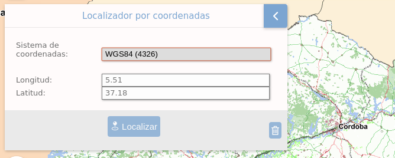

# M.plugin.XYLocator

Plugin que permite localizar las coordenas introducidas por el usuario en un Sistema de referencia determinado. Las coordenadas son transformadas al sistema de referencia del mapa en ese momento.



## Dependencias

- xylocator.ol.min.js
- xylocator.ol.min.css


```html
 <link href="../../plugins/xylocator/xylocator.ol.min.css" rel="stylesheet" />
 <script type="text/javascript" src="../../plugins/xylocator/xylocator.ol.min.js"></script>
```

## Parámetros

- El constructor se inicializa con un JSON de options con el siguiente atributo:

- **position**. Indica la posición donde se mostrará el plugin
  - 'TL':top left (default)
  - 'TR':top right
  - 'BL':bottom left
  - 'BR':bottom right

## Eventos

- **xylocator:locationCentered**
  - Evento que se dispara cuando se ha localizado la búsqueda del plugin sobre el mapa.
  - Expone, como parámetro devuelto, el **punto** actual calculado en la búsqueda

```javascript
mp.on('xylocator:locationCentered', (data) => {
   window.alert(`zoom: ${data.zoom}
   center: ${data.center[0].toFixed(2)}, ${data.center[1].toFixed(2)}`);
});
```

## Otros métodos

## Ejemplos de uso

### Ejemplo 1
```javascript
  const map = M.map({
    container: 'map'
  });

  const mp = new M.plugin.XYLocator({
    position: 'TL',
  });

  map.addPlugin(mp);
```
### Ejemplo 2
```javascript
  const map = M.map({
    container: 'map'
  });

  const mp = new M.plugin.XYLocator();

  map.addPlugin(mp);
```
